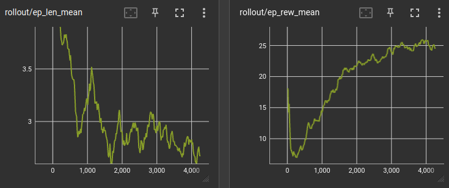
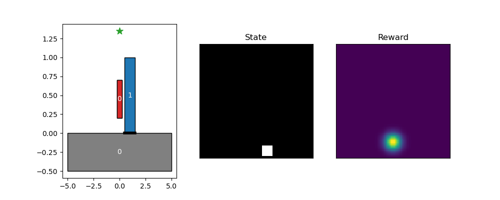
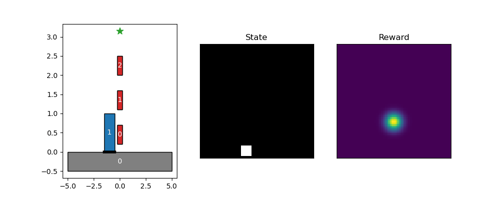

## How to setup the environment

```bash
# create the Conda environment 
$ conda env create -f block_rl_env.yml
$ conda activate block_rl

# Stable‑Baselines3 extras: usefull to have the training progress bar.
$ pip install stable-baselines3\[extra\]

```

---

## How does the env work?

### `assembly_env.py`

Low‑level **geometry & physics** backend.  Responsible for:

* keeping the list of blocks (`self.block_list`)
* collision checks & static stability (`is_stable_rbe`)
* dense reward heat‑map generation

### `assembly_gym.py`

Gymnasium **wrapper** that the RL agent actually interacts with.  It:

* exposes a `Discrete(300)` action space with automatic **action‑masking**
* concatenates *state image* + *reward image* into a single flat observation
* offers live Matplotlib rendering (`--render`)

### `train.py`

Train an agent with **Stable‑Baselines3**.  Key CLI flags (run `-h` for all):

| Flag                   | Default     | Description                                               |
| ---------------------- | ----------- | --------------------------------------------------------- |
| `--task`               | `bridge`    | Task to learn: `bridge`, `tower`, `double_bridge`         |
| `--algo`               | `maskppo`   | RL algorithm: `maskppo` (masked PPO) or plain `ppo`       |
| `--timesteps`          | `200_000`   | Total training steps (across **all** envs)                |
| `--save-freq`          | `10_000`    | Checkpoint frequency (steps) for saving models & eval     |
| `--logdir`             | `runs`      | Output directory for checkpoints and TensorBoard logs     |
| `--device`             | `cpu`       | Compute device: `cpu`, `cuda`, or `auto`                  |
| `--render`             | `False`     | Render the environment (only works when `--n-envs 1`)     |
| `--debug`              | `False`     | Enable DEBUG‑level logging                                |
| `--progress-bar`       | `False`     | Show SB3 progress bar during training                     |
| `--config`             | *None*      | Path to YAML with extra hyper‑parameters (overrides CLI)  |
| `-m`, `--resume-model` | *None*      | Path to a `.zip` model to continue training from          |
| `-n`, `--n-envs`       | `1`         | Number of parallel environments (≥2 uses `SubprocVecEnv`) |

**Train from scratch**

```bash
python train.py --task bridge --algo maskppo --timesteps 100000 --progress-bar --config configs/maskppo.yaml  
```

**Resume training**

```bash
python train.py --task bridge --algo maskppo --timesteps 100000 --progress-bar --config configs/maskppo.yaml  -m runs/bridge_maskppo_0506204539/best_model/best_model.zip
```

**Monitor training**
To monitor the training you can run the following command in the main directory.

```bash
tensorboard --logdir runs
```



### `run_policy.py`

Roll out a **trained policy** for qualitative inspection.

```bash
python run_policy.py --model runs/bridge_maskppo_0506212053/best_model/best_model.zip --task bridge --algo maskppo --render --debug
```

Here is an example of a rollout




---

## RL choices

### Maskable PPO (`maskppo`)

* **Observation**   8192‑D vector (2 × 64 × 64 images flattened).
* **Action space**  300 discrete indices; 
* **Reward**        sum of overlaps between the newly placed block and Gaussian blobs centred on targets.
* **Masking**       `sb3_contrib.ActionMasker` removes illegal moves before softmax → faster learning & fewer crashes.

Other SB3 algorithms (SAC, A2C…) will work, but the policy network must be adapted to flat image inputs.

---

## Things to maybe change/Improve
- Change the observations to include obstacles (maybe change the rl network to cnn and have 3 channels (obstacles,placed blocks,reward features))
- Change how the agent interacts with the actions (right now it choose an index in the list of possible actions but it doesnt now what the effect will be/what it is choosing) -> maybe make an action encoder? Or add action to observation space?

## Project Ideas to implement (at least 1)

- The policy should generate various kind of possible structures for a same task
- The policy should be able to complete an episode starting from some arbitrary/random situation not seen during training.
- Generate some interesting and novel structures
- Minimise the number of blocks used by the policy to complete the episode
- Use new types of block geometries
- Train a policy that is robust to noise injected when placing a block (important for sim2real transition to a real robot).

---


